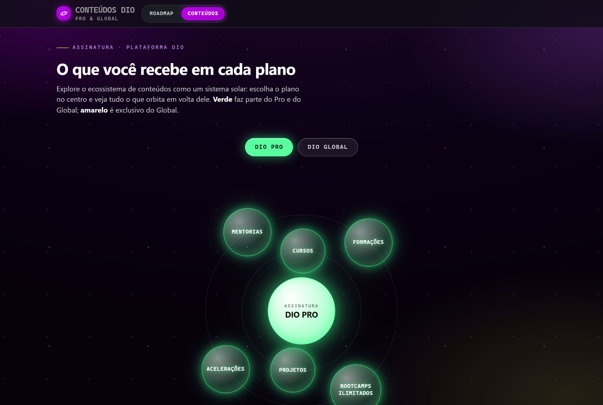
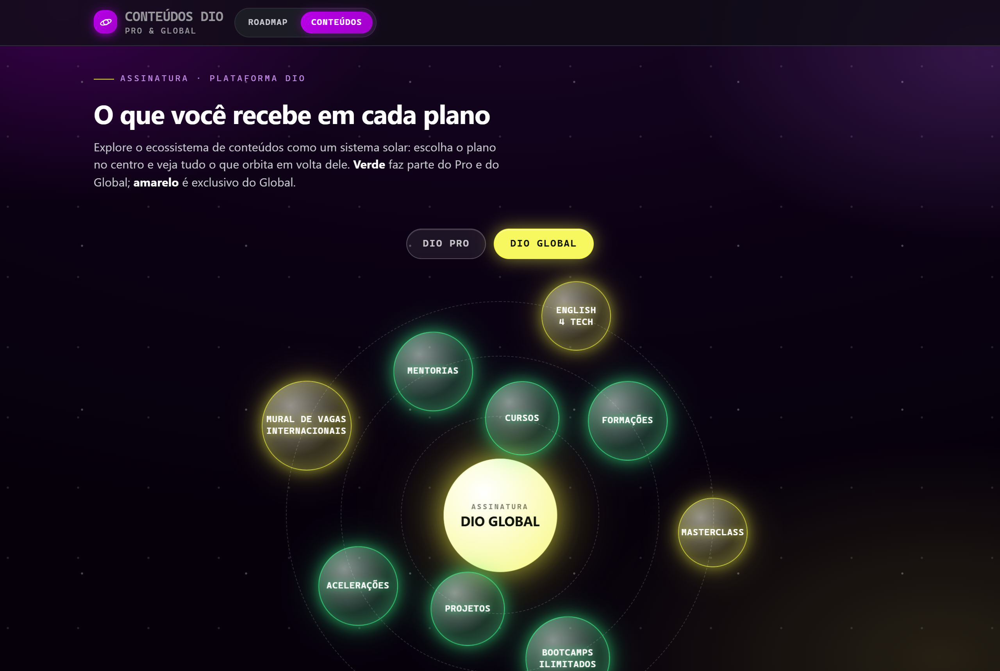

# 🚀 DIO Explorer

### Um jeito visual e divertido de descobrir tudo o que você pode aprender na DIO.

 

 

### 🌐 [**Acessar o site**](https://felipeaguiarcode.github.io/dio-explorer/)

 

 

## ✨ O que é isto?

O **DIO Explorer** é um site simples e bonito que mostra, de forma visual, o caminho de aprendizado
da [DIO](https://web.dio.me/). Em vez de listas cansativas, você vê **mapas**, **blocos** e até um
**sistema solar animado** — assim fica fácil entender por onde começar e o que cada plano oferece.

Não precisa instalar nada. É só abrir no navegador. 😉

 

## 🗺️ O que você encontra

- **Roadmap — "Por onde eu começo?"**
  As formações da DIO montadas como **torres de LEGO**. Escolha a carreira dos seus sonhos e vá
  encaixando as peças, do básico ao avançado.

- **Conteúdos — o sistema solar dos planos**
  Uma tela animada onde o seu plano fica no **centro** e tudo o que ele inclui **gira em volta**
  como planetas. Compare o **DIO Pro** e o **DIO Global** com um clique.

 

|  DIO Pro  |  DIO Global  |
|:---------:|:------------:|
|  |  |
| 🟢 Conteúdos em **verde** | 🟡 Extras exclusivos em **amarelo** |

 

## 🖱️ Como usar

1. Abra o site pelo botão **[🌐 Acessar o site](https://felipeaguiarcode.github.io/dio-explorer/)**.
2. Na aba **Roadmap**, clique na carreira que combina com você e veja a trilha completa.
3. Na aba **Conteúdos**, troque entre **DIO Pro** e **DIO Global** para ver o que cada plano oferece.
4. Clique em qualquer **planeta** para ler o que aquele conteúdo significa.

 

## 🛠️ Feito com

HTML, CSS e JavaScript puro — **sem nenhuma dependência**. Leve, rápido e funciona direto no navegador.

 

Feito com 💜 para a comunidade **DIO**

